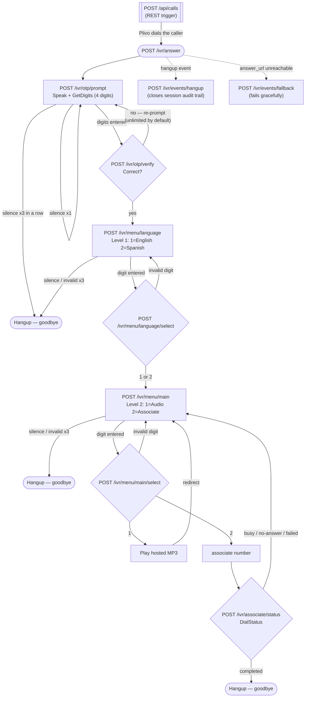

# Call Flow

This is the exact state machine implemented in `app/routers/ivr.py`. Every box
is a webhook endpoint; every edge is either a Plivo `<Redirect>`/`action`
callback or a caller keypress.

## Guard rails baked into every box

- **Every `<GetDigits>` is followed by a `<Redirect>`.** If Plivo gets no DTMF
  at all, it does not call `action` — it falls through to the next XML
  element. Without that trailing redirect, silence would kill the call
  outright instead of re-prompting.
- **Authentication is re-checked on every hop**, not just at the OTP step.
  Callback URLs are guessable; `E`, `F`, `G`, `H` all bounce an
  unauthenticated caller back to the OTP prompt rather than trusting that a
  session marked authenticated earlier is still theirs.
- **Wrong OTP re-prompts indefinitely by default** (`OTP_MAX_ATTEMPTS=0`), per
  the assignment. Silence and off-menu keypresses are capped separately
  (`MAX_CONSECUTIVE_INVALID_INPUTS`, default 3) so a forgotten handset can't
  hold the line open forever — that cap is a safety net, not a spec
  requirement, and is documented as such in `.env.example`.
